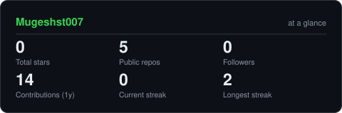
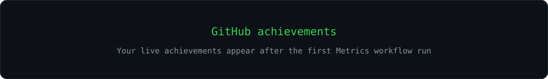
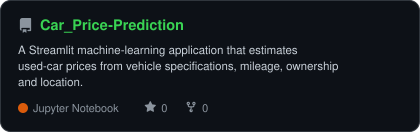
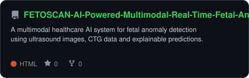
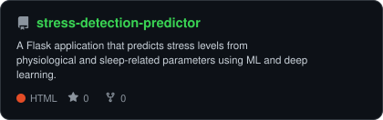
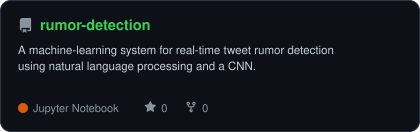

<div align="center">

<!-- Replace this GitHub avatar with assets/portrait.svg after running dotify.py on your original photo. -->


<br>

<a href="https://github.com/Mugeshst007">
  
</a>

<br>

<a href="https://linkedin.com/in/mugesh-st"></a>
<a href="mailto:stmugesh18@gmail.com"></a>
<a href="https://www.instagram.com/mugesh_st/"></a>


</div>

---

## `~/` whoami

```console
$ cat about.txt
```

Hi, I'm **Mugesh ST**, an Artificial Intelligence and Data Science graduate. I build practical
AI systems that connect data, machine-learning models, APIs and clear user experiences.

- Building projects across **machine learning, NLP, computer vision and healthcare AI**
- Currently exploring **Transformers, Generative AI, LangChain and SAP ABAP**
- Presented my multimodal **FetoScan** healthcare AI project at a conference
- Open to **AI/ML, Data Science and Python Developer** opportunities
- Fun fact: **I enjoy turning a model in a notebook into a complete working application.**

<br>

<div align="center">

## `~/` toolbox


<br>


</div>

---

<div align="center">

## `~/` skill radar

<table>
<tr>
<td width="50%" align="center" valign="middle">

<picture>
  <source media="(prefers-color-scheme: dark)" srcset="assets/radar-dark.svg">
  <source media="(prefers-color-scheme: light)" srcset="assets/radar-light.svg">
  
</picture>

</td>
<td width="50%" align="center" valign="middle">

<picture>
  <source media="(prefers-color-scheme: dark)" srcset="assets/radar-langs-dark.svg">
  <source media="(prefers-color-scheme: light)" srcset="assets/radar-langs-light.svg">
  
</picture>

</td>
</tr>
</table>

</div>

---

<div align="center">

## `~/` contribution calendar

<!-- Generated by the Metrics workflow after METRICS_TOKEN is configured. -->


<br><br>

<!-- Generated on the output branch by the Snake workflow. -->
<picture>
  <source media="(prefers-color-scheme: dark)" srcset="https://raw.githubusercontent.com/Mugeshst007/Mugeshst007/output/snake-dark.svg">
  <source media="(prefers-color-scheme: light)" srcset="https://raw.githubusercontent.com/Mugeshst007/Mugeshst007/output/snake.svg">
  
</picture>

</div>

---

<div align="center">

## `~/` the numbers

<picture>
  <source media="(prefers-color-scheme: dark)" srcset="assets/card-stats-dark.svg">
  <source media="(prefers-color-scheme: light)" srcset="assets/card-stats-light.svg">
  
</picture>

<br><br>

<!-- These are created by the Metrics workflow. -->


<br><br>



</div>

---

<div align="center">

## `~/` selected work

<!-- These stable cards are generated inside this repository by scripts/cards.py. -->
<table>
<tr>
<td width="50%">
  <a href="https://github.com/Mugeshst007/Car_Price-Prediction">
    <picture>
      <source media="(prefers-color-scheme: dark)" srcset="assets/card-Car_Price-Prediction-dark.svg">
      <source media="(prefers-color-scheme: light)" srcset="assets/card-Car_Price-Prediction-light.svg">
      
    </picture>
  </a>
</td>
<td width="50%">
  <a href="https://github.com/Mugeshst007/FETOSCAN-AI-Powered-Multimodal-Real-Time-Fetal-Anomaly-Detection-">
    <picture>
      <source media="(prefers-color-scheme: dark)" srcset="assets/card-FETOSCAN-AI-Powered-Multimodal-Real-Time-Fetal-Anomaly-Detection--dark.svg">
      <source media="(prefers-color-scheme: light)" srcset="assets/card-FETOSCAN-AI-Powered-Multimodal-Real-Time-Fetal-Anomaly-Detection--light.svg">
      
    </picture>
  </a>
</td>
</tr>
<tr>
<td width="50%">
  <a href="https://github.com/Mugeshst007/stress-detection-predictor">
    <picture>
      <source media="(prefers-color-scheme: dark)" srcset="assets/card-stress-detection-predictor-dark.svg">
      <source media="(prefers-color-scheme: light)" srcset="assets/card-stress-detection-predictor-light.svg">
      
    </picture>
  </a>
</td>
<td width="50%">
  <a href="https://github.com/Mugeshst007/rumor-detection">
    <picture>
      <source media="(prefers-color-scheme: dark)" srcset="assets/card-rumor-detection-dark.svg">
      <source media="(prefers-color-scheme: light)" srcset="assets/card-rumor-detection-light.svg">
      
    </picture>
  </a>
</td>
</tr>
</table>

<sub>

| project | focus | stack |
|---|---|---|
| **[Car Price Prediction](https://github.com/Mugeshst007/Car_Price-Prediction)** | Predictive analytics | `Python` `Streamlit` `scikit-learn` |
| **[FetoScan](https://github.com/Mugeshst007/FETOSCAN-AI-Powered-Multimodal-Real-Time-Fetal-Anomaly-Detection-)** | Multimodal healthcare AI | `TensorFlow` `CNN` `FastAPI` |
| **[Stress Detection](https://github.com/Mugeshst007/stress-detection-predictor)** | ML web application | `Flask` `Random Forest` `Neural Network` |
| **[Rumor Detection](https://github.com/Mugeshst007/rumor-detection)** | NLP classification | `CNN` `NLP` `Jupyter` |

</sub>

</div>

---

<div align="center">

<sub>`01110100 01101000 01100001 01101110 01101011 01110011 00100000 01100110 01101111 01110010 00100000 01110011 01100011 01110010 01101111 01101100 01101100 01101001 01101110 01100111`</sub>

</div>
